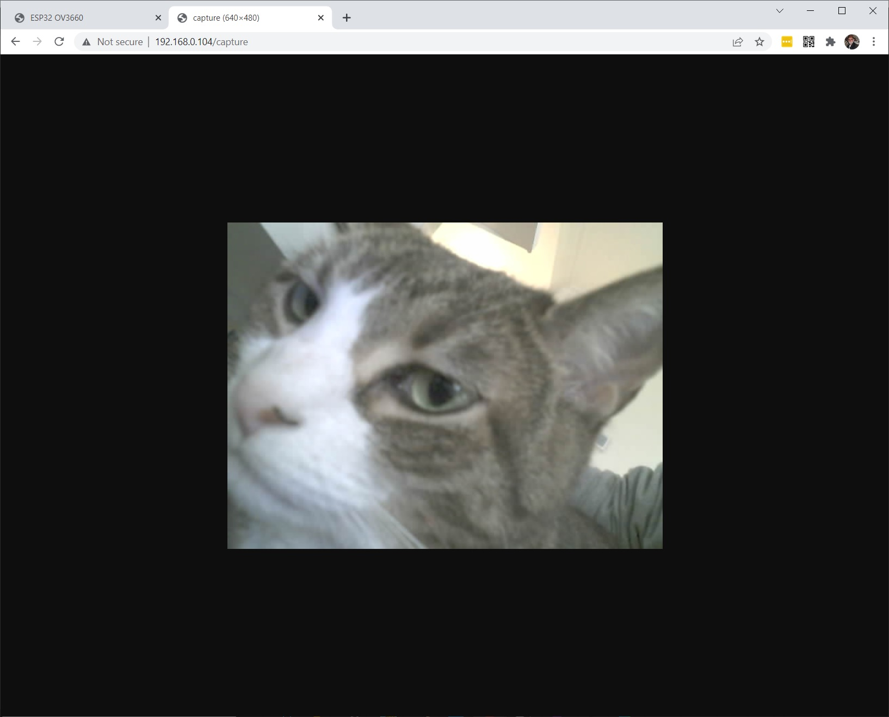
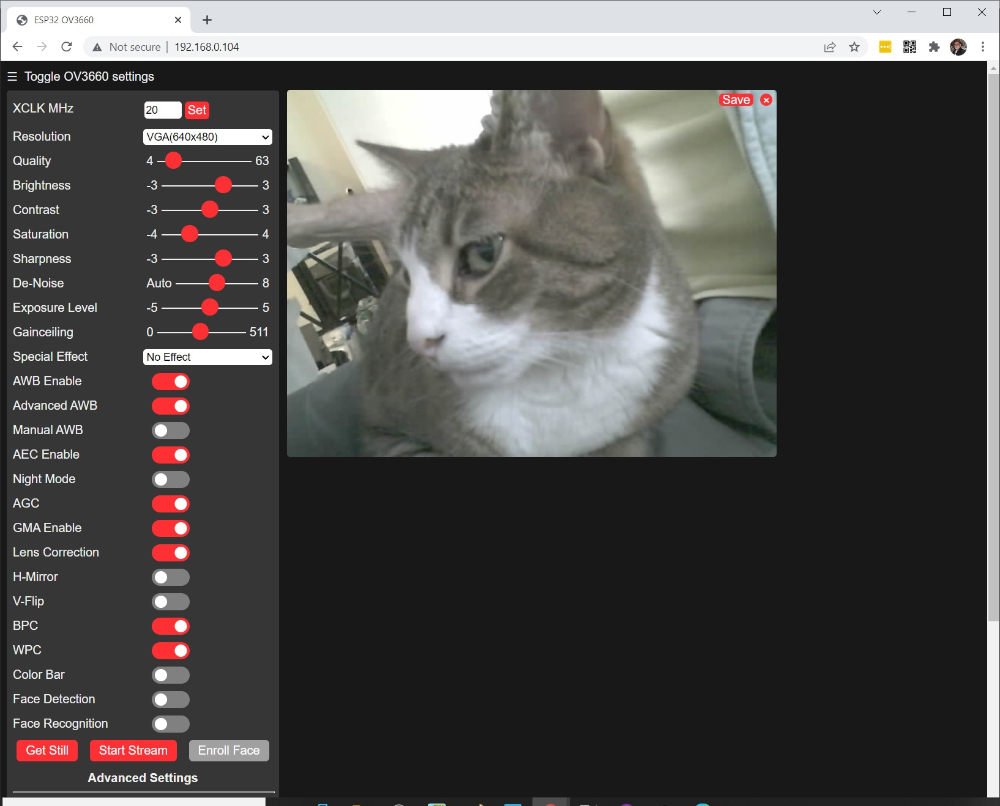
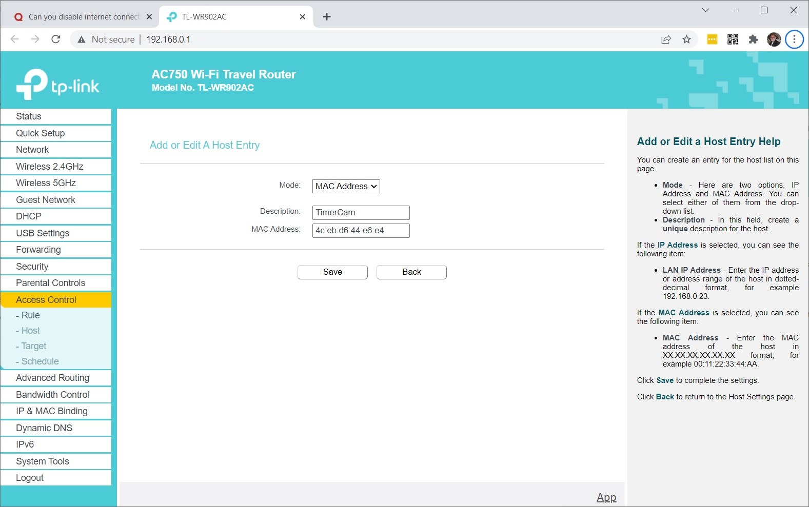
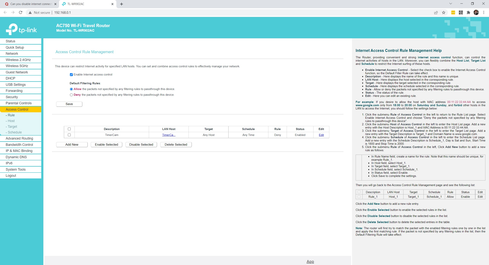

# M5Stack Timer Camera X Photo Capture

## Experiments capturing still photos with the Timer Camera X.
 
Processing.org Java sketch requests JPG still images from Timer Camera X and saves in output folder

https://shop.m5stack.com/products/esp32-psram-timer-camera-x-ov3660

https://github.com/m5stack/TimerCam-arduino

ESP32 PSRAM Timer Camera X (OV3660)

SKU: U082-X

### Requires customized Arduino example web_cam.ino code installed on Timer Camera X with changes for WiFi ssid and password.

### Changes to my router to prevent Timer Camera X from accessing the Internet in any way accept local WiFi network.

